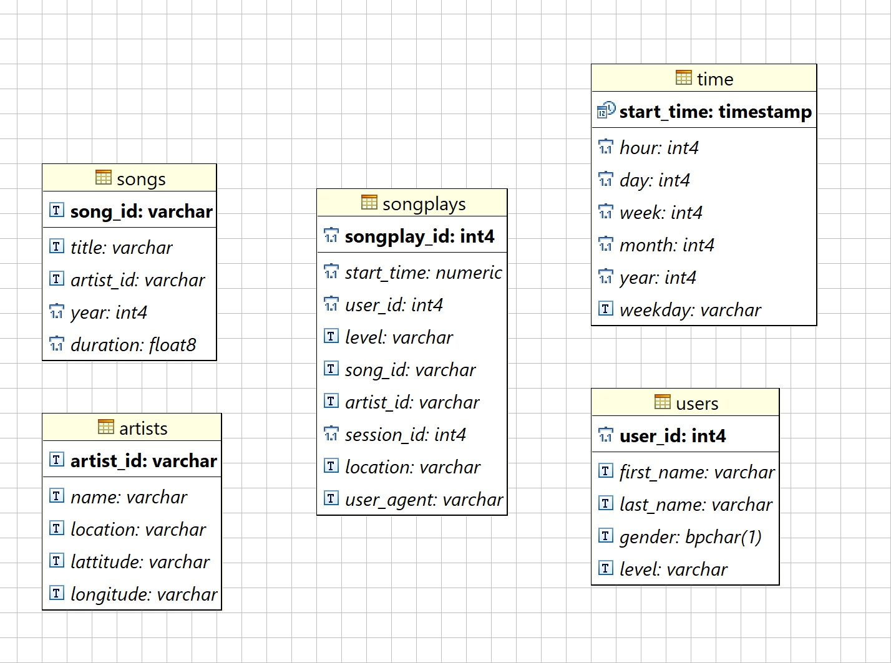

# DEND

### BEFORE ANYTHING ...

In order to make easier this project implementation, we have used docker containers to create our database.
Refer 2 the following links to make it work by docker-compose:

* https://www.docker.com/
* https://docs.docker.com/compose/

Once is done:

```
docker-compose up -d 
```

### SUMMARY ...

* sql_queries.py: set of sql instructions 2 drop, create and load postgres tables ...
* create_tables.py: set of python functions 4: creating database, droping tables and creating tables ...
* etl.py: once ddls have been executed, proceed to load data modelling ...

### DATABASE DIAGRAM ...

Inline-style: 



### HOW TO ...

```
python create_tables.py
python etl.py
```

### DOCUMENT PROCESS ...

__Discuss the purpose of this database in the context of the startup, Sparkify, and their analytical goals.__

The main point is the creation of a robust data modelling, star model, to query in order to obtain information about songs, artist and users during a time dimension. In the future, data scientists based on information loaded in our database, could recommend different options to our users thanks our historic information loaded.

__State and justify your database schema design and ETL pipeline.__

The model used is star model. There is not necessary to implement a snow flake model due to we dont have too much information to implement more dimensions.

